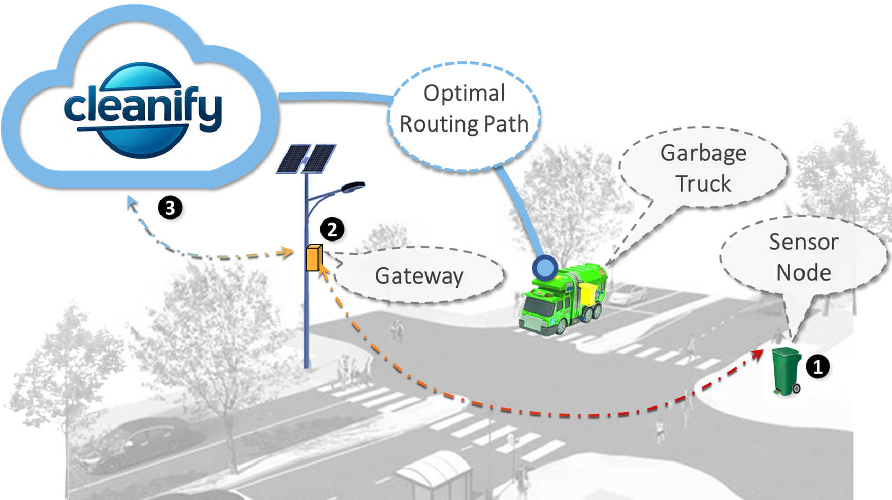
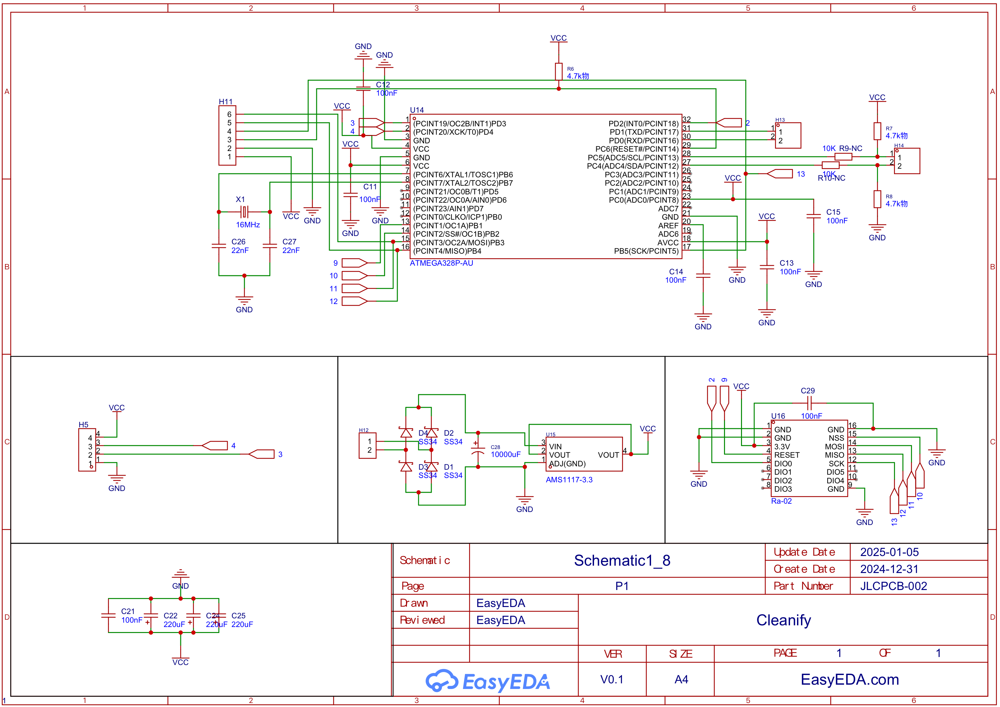
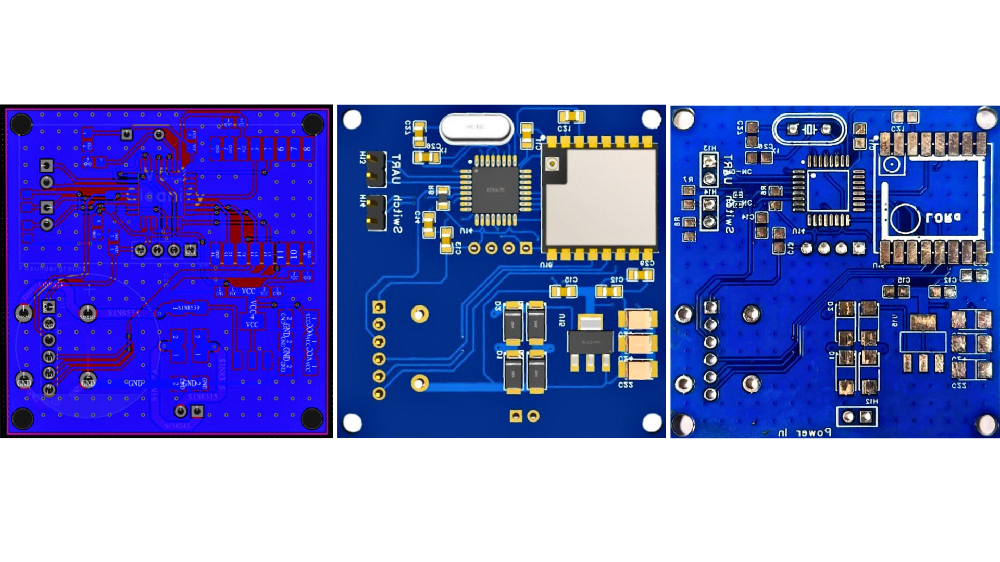
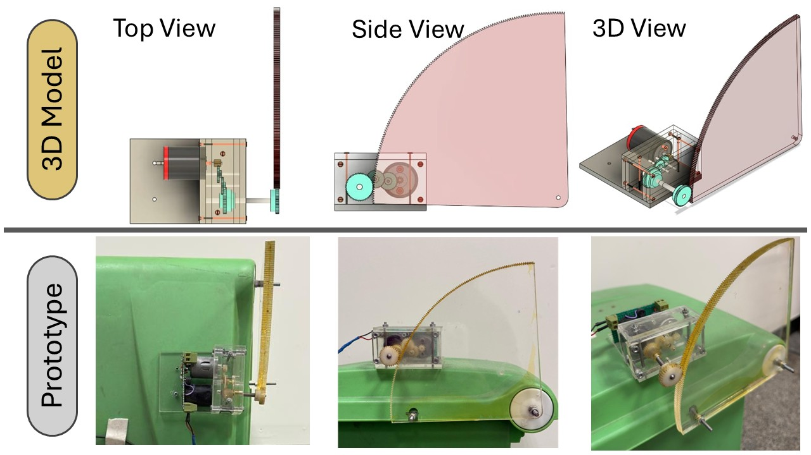
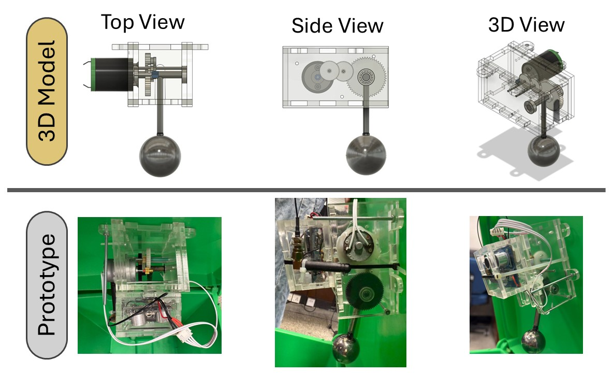
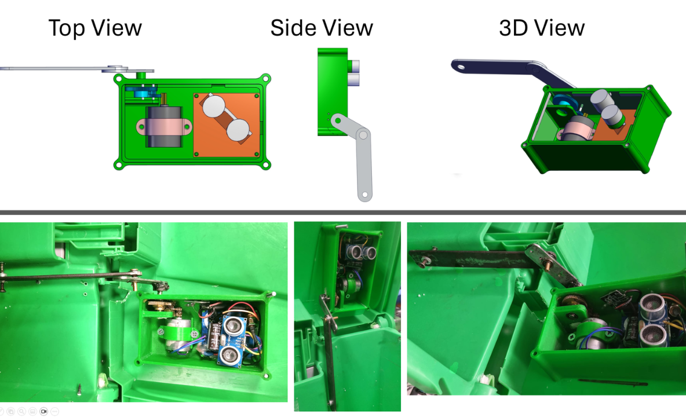
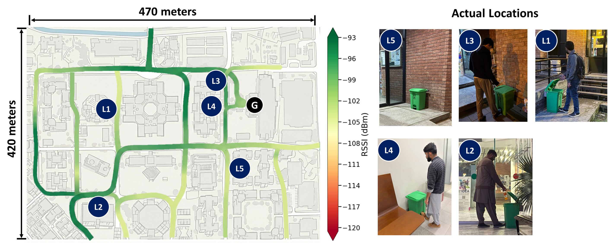

# Cleanify: Smart Batteryless Waste Management System

Cleanify is a batteryless smart bin sensor that harvests kinetic energy from bin lid motion to power fill-level sensing and LoRaWAN transmission — no batteries, no maintenance.

---

## Highlights

- **Batteryless Operation:** Kinetic energy harvested from every lid interaction powers a full sense-and-transmit cycle.
- **Plug-and-Play Retrofit:** Attaches to standard hinged or foot-pedal bins without structural modification.
- **LoRaWAN Communication:** Long-range, low-power transmission to a cloud backend for collection scheduling.
- **Commodity Hardware:** Built entirely from locally available, low-cost components (~$53/unit at volume).
- **Field Validated:** Deployed across 5 campus locations under real-world conditions.

---

## Architecture



| Component | Description |
|:---|:---|
| **`firmware/sensor-node/transmitter-p2.ino`** | **Sensor Node Firmware:** Handles MCU boot, HC-SR04 ultrasonic sensing, and LoRa packet transmission on each lid actuation event. |
| **`firmware/sensor-node/receiver-p2.ino`** | **Gateway-Side Receiver:** Receives LoRa packets and forwards data upstream. |
| **`firmware/field_testing/data_collection.ino`** | **Lid Characterization Firmware:** Used during the user behavior study to log opening angle, duration, and encoder data. |
| **`firmware/field_testing/data_collection.py`** | **Data Logger:** Receives and stores lid interaction data from the instrumented bin. |
| **`hardware/cad/`** | **CAD Designs:** 3D models and source files for all three harvester iterations. |
| **`hardware/Physical Setup/`** | **Physical Builds:** Photos and documentation of the physical implementations. |
| **`hardware/pcb/`** | **PCB Design:** Schematic and layout files for the sensor node. |

---

## Hardware

### Sensor Node

| Block | Components |
|---|---|
| Energy Harvesting | 24V DC motor (generator mode), 3-stage spur gear train (1:42.6 ratio) |
| Storage & Gating | 1000µF capacitor, mercury tilt switch, SS34 Schottky diode |
| Sensing | HC-SR04 ultrasonic sensor |
| Compute | ATmega328P MCU, MP2307 buck converter (3V rail) |
| Communication | RA-02 LoRa module (Semtech SX1278) |





### Prototype Evolution

| Version | Mechanism | Outcome |
|---|---|---|
| Proof of Concept | External disc gear | Feasibility validated; not deployment-ready |
| Prototype 1 | Internal pendulum | Mechanical failure ~300 actuations; 132% weight overhead |
| **Prototype 2** | **Internal shaft linkage** | **Final design — lightweight, robust, maintenance-free** |

| Proof of Concept | Prototype 1 | Prototype 2 |
|---|---|---|
|  |  |  |

CAD source files (Fusion 360, STEP, STL) for all three iterations are in `hardware/cad/`. Physical build documentation is in `hardware/Physical Setup/`.

---

## Setup & Installation

### Prerequisites

- Arduino IDE or Arduino CLI
- ATmega328P board support (`arduino:avr`)
- ESP32 board support (for field testing firmware)
- Python 3.x with `pyserial` (for `data_collection.py`)

### 1. Clone

```bash
git clone <repository-url>
cd Cleanify
```

### 2. Install Python dependencies

```bash
pip install pyserial
```

---

## Usage

### 1. Sensor Node (Prototype 2)

Flash `transmitter-p2.ino` onto the ATmega328P sensor node:

```bash
arduino-cli compile --fqbn arduino:avr:pro firmware/sensor-node/
arduino-cli upload  --fqbn arduino:avr:pro --port /dev/ttyUSB0 firmware/sensor-node/transmitter-p2.ino
```

Flash `receiver-p2.ino` onto the gateway-side node:

```bash
arduino-cli upload --fqbn arduino:avr:pro --port /dev/ttyUSB1 firmware/sensor-node/receiver-p2.ino
```

On each lid actuation, the node executes:

```
Lid opens  → energy harvested into capacitor
Lid closes → tilt switch connects buffer to electronics
MCU boots  → HC-SR04 fires → fill level measured → LoRa packet transmitted → powers down
```

### 2. Field Testing / Lid Characterization

Flash `data_collection.ino` onto the instrumented ESP32 bin:

```bash
arduino-cli compile --fqbn esp32:esp32:esp32 firmware/field_testing/
arduino-cli upload  --fqbn esp32:esp32:esp32 --port /dev/ttyUSB0 firmware/field_testing/data_collection.ino
```

Start the host-side logger:

```bash
python firmware/field_testing/data_collection.py
```

Logged fields per interaction: opening angle (°), opening duration (s), closing duration (s), timestamp.

---

## LoRa Packet Layout

See `firmware/sensor-node/packet-layout.svg` for the full packet structure diagram.

| Field | Size | Description |
|---|---|---|
| `device_id` | 2 bytes | Unique bin identifier |
| `fill_level` | 2 bytes | HC-SR04 distance reading (cm) |
| `timestamp` | 4 bytes | Unix timestamp of actuation |
| `rssi` | 1 byte | Signal strength (gateway-side) |

LoRa physical layer config: SF10, BW 125 kHz, CR 4/8, TX power 20 dBm.

---

## Field Deployment



Five bins deployed sequentially across LUMS campus under real-world conditions (18–38°C, 40–85% humidity, occasional rainfall):

| Location | Description |
|---|---|
| L1 — Library | High traffic during academic hours |
| L2 — Business School | Moderate–high traffic, peaks at class transitions |
| L3 — Cafe Entrance | High traffic concentrated around meal times |
| L4 — Cafeteria | High traffic, rapid successive actuations |
| L5 — Dormitories | Variable traffic, peaks morning and evening |


Post-deployment inspection: zero water ingress, no corrosion, no mechanical degradation.