# Motion-Coupled Sensing: When the State Change Powers Its Own Sensing

A self-powered IoT platform that harvests kinetic energy from mechanical access events — bin lids, room doors, and office cabinet hinges — to power and transmit sensor readings with no batteries and no scheduled maintenance.

> **Experiment videos, setup photos, and build documentation:** [media/README.md](media/README.md)

---

## How It Works

Objects whose state changes only through a mechanical action carry enough kinetic energy in that motion to power both a sensor reading and a LoRa uplink. The system wakes only when there is something to report, and the event itself supplies the energy to do it. There is no polling, no sleep schedule, and no battery to replace.

An electromagnetic harvester — a DC motor in generator mode driven through a compact gear train — is retrofitted to the hinge or lid mechanism without any structural modification to the host object.

## Repository Structure

```
├── firmware/
│   ├── sensor-node/                  # Sensor node and gateway firmware, packet-layout SVG
│   └── bin_unit_field_testing/       # Bin lid characterization firmware + serial data logger
├── hardware/
│   ├── harvestor_cad/                # STEP, STL, SLDPRT, DXF files; CAD modeling video
│   └── pcb/                          # PCB schematic, layout, EPRO project, netlist
└── media/
    └── images/
        ├── bin-unit/                 # Bin unit build and deployment photos
        ├── door-unit/                # Door unit build photos
        ├── cabinet-unit/             # Cabinet unit build photos
        └── harvestor.png             # Harvester overview image
```

---

## Results at a Glance

| Deployment | Actuations | Transmission Reliability |
|:---|---:|---:|
| Waste Bins — 5 campus locations | 5,945 | **99.3%** |
| Room Doors | 289 | **87.2%** |
| Office Cabinets | 206 | **89.3%** |

---

## Harvester


| Parameter | Value |
|:---|:---|
| Generator | 24V DC motor (generator mode) |
| Gear Train | 3-stage spur, 1:42.6 ratio |
| Storage | 1000 µF capacitor |
| Gating | Mercury tilt switch + SS34 Schottky diode |

CAD source files (STEP, STL, SolidWorks SLDPRT, DXF drawings, and drawing PDF) are in [`hardware/harvestor_cad/`](hardware/harvestor_cad/).


---

## Sensor Node

| Block | Components |
|:---|:---|
| Sensing | HC-SR04 ultrasonic sensor |
| Compute | ATmega328P MCU, MP2307 buck converter (3V rail) |
| Communication | RA-02 LoRa module (Semtech SX1278) |

### PCB

| Schematic | Layout |
|:---:|:---:|
|  |  |

Design files (EPRO project, netlist, schematic PDF) are in [`hardware/pcb/`](hardware/pcb/).

---

## Form Factors

### Waste Bin

Measures fill level via ultrasonic ranging on every lid open. Deployed across 5 campus locations under real-world conditions (18–38°C, 40–85% humidity, occasional rainfall).

| | | |
|:---:|:---:|:---:|
| 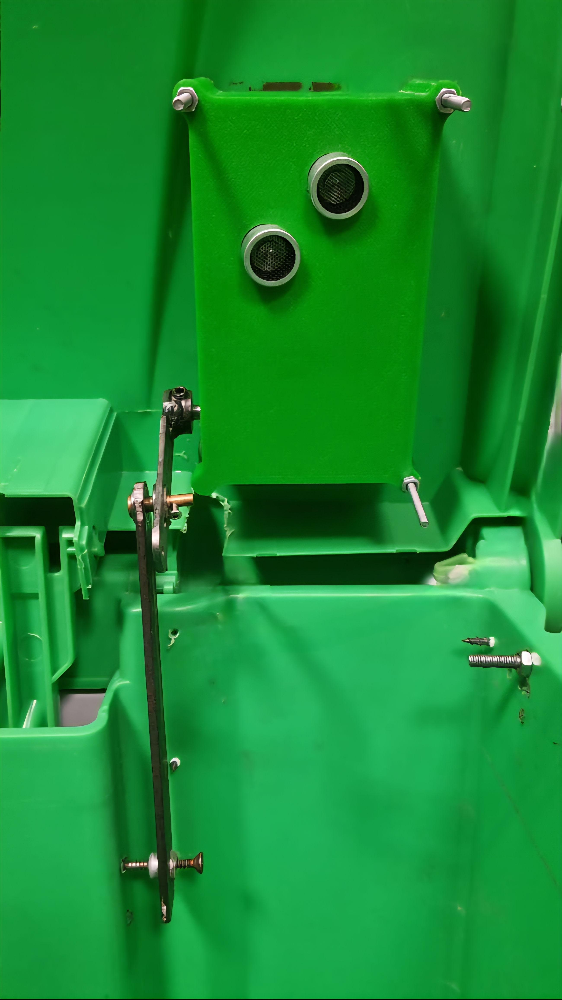 | 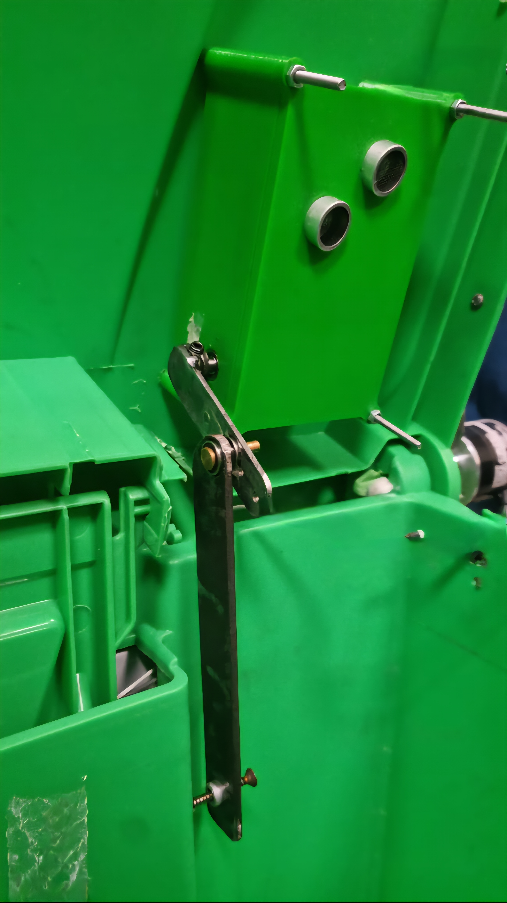 | 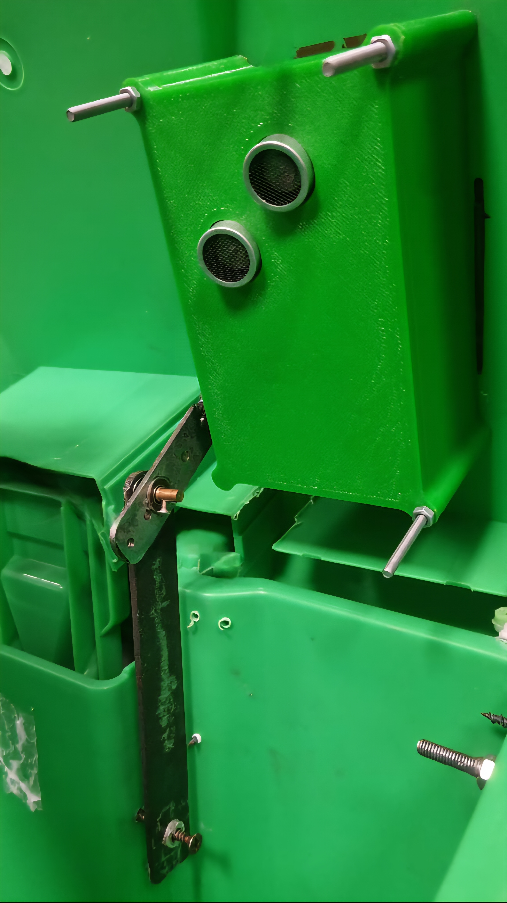 |
| 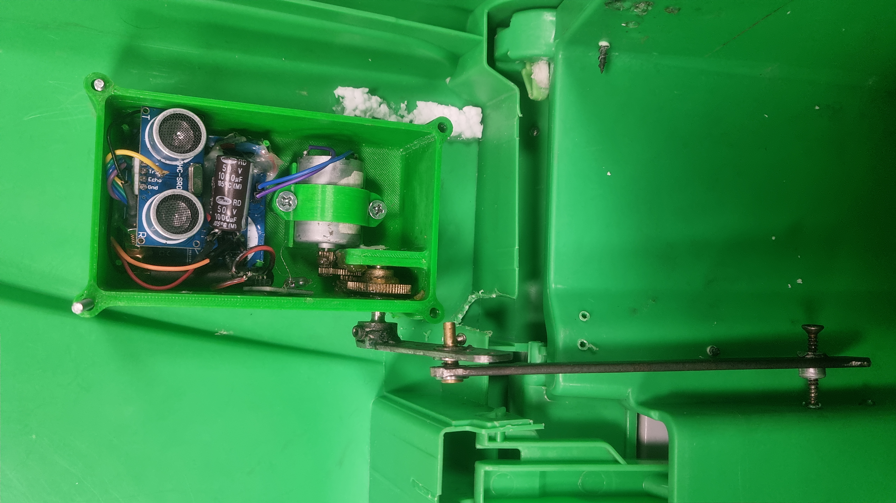 | 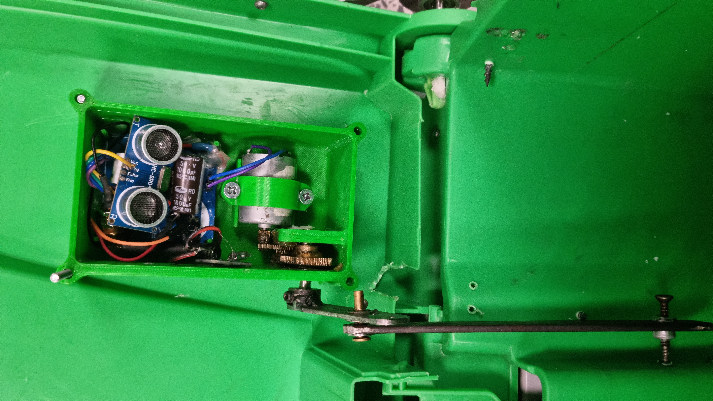 | 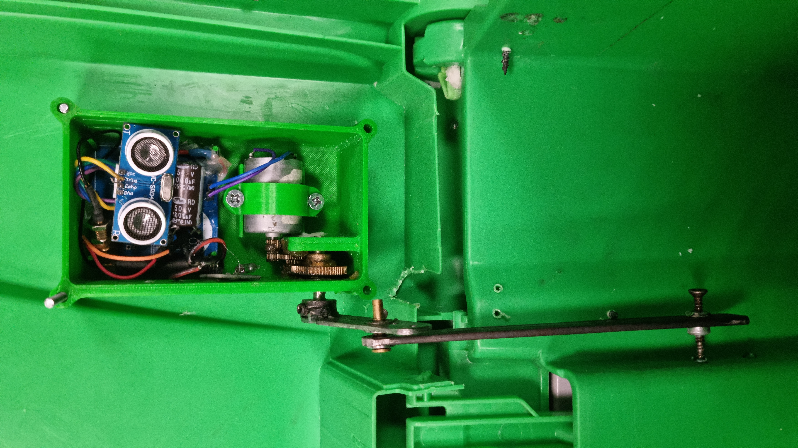 |

### Room Door

Retrofit mounted to the door hinge. Reports each door swing as an access event.

| | |
|:---:|:---:|
| 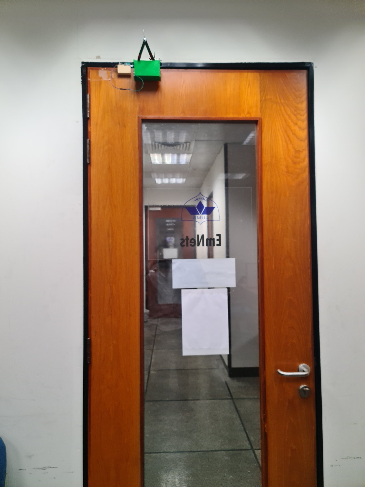 | 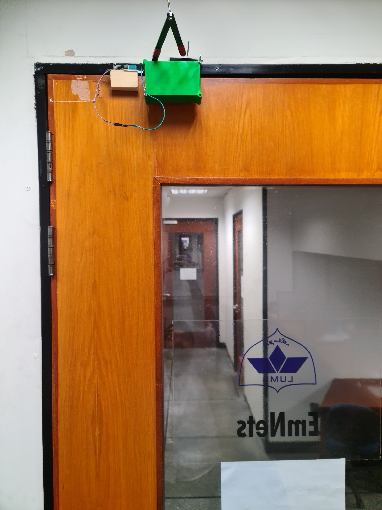 |

### Office Cabinet

Harvester mounted on the cabinet hinge. Reports each cabinet open as an access event.

| | |
|:---:|:---:|
| 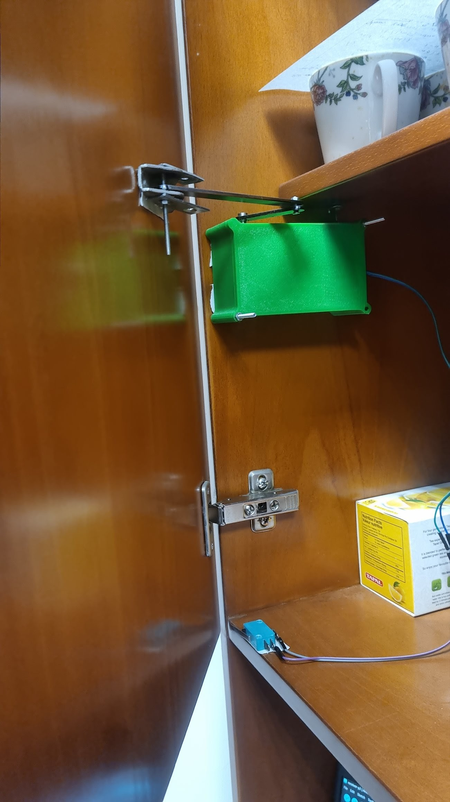 | 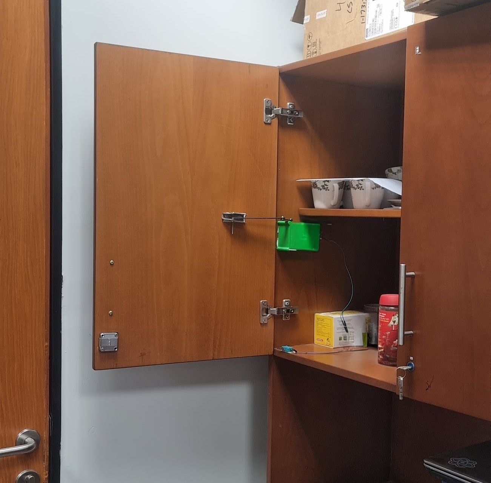 |

---

## Firmware

| File | Purpose |
|:---|:---|
| [`firmware/sensor-node/transmitter-p2.ino`](firmware/sensor-node/transmitter-p2.ino) | Sensor node: MCU boot, ultrasonic sensing, LoRa uplink |
| [`firmware/sensor-node/receiver-p2.ino`](firmware/sensor-node/receiver-p2.ino) | Gateway receiver: captures LoRa packets and forwards upstream |
| [`firmware/bin_unit_field_testing/data_collection/data_collection.ino`](firmware/bin_unit_field_testing/data_collection/data_collection.ino) | Bin characterization: logs lid angle, duration, and encoder data |
| [`firmware/bin_unit_field_testing/data_collection.py`](firmware/bin_unit_field_testing/data_collection.py) | Serial data logger: receives and stores lid interaction records |

### LoRa Packet Layout

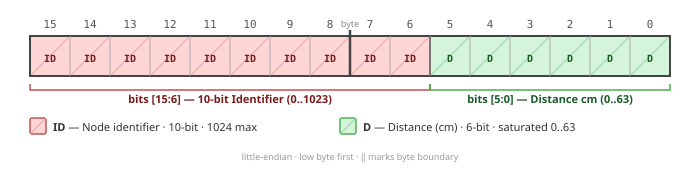

| Field | Size | Description |
|:---|:---:|:---|
| `device_id` | 2 bytes | Unique unit identifier |
| `fill_level` | 2 bytes | HC-SR04 distance reading in cm (bin deployments) |
| `timestamp` | 4 bytes | Unix timestamp of actuation |
| `rssi` | 1 byte | Received signal strength (gateway-side) |

LoRa physical layer: SF10, BW 125 kHz, CR 4/8, TX power 20 dBm.

---

## Bin Field Deployment


Five units deployed sequentially across campus:

| Location | Traffic Profile |
|:---|:---|
| L1 — Library | High traffic during academic hours |
| L2 — Business School | Moderate–high traffic, peaks at class transitions |
| L3 — Cafe Entrance | High traffic concentrated around meal times |
| L4 — Cafeteria | High traffic, rapid successive actuations |
| L5 — Dormitories | Variable traffic, peaks morning and evening |

Post-deployment inspection across all units: zero water ingress, no corrosion, no mechanical degradation.

---

## Setup & Usage

**Requirements:** Arduino IDE/CLI with ATmega328P and ESP32 board support, Python 3.x with `pyserial`.

```bash
git clone <repository-url>
pip install pyserial
```

Flash sensor node and gateway receiver:

```bash
arduino-cli upload --fqbn arduino:avr:pro --port /dev/ttyUSB0 firmware/sensor-node/transmitter-p2.ino
arduino-cli upload --fqbn arduino:avr:pro --port /dev/ttyUSB1 firmware/sensor-node/receiver-p2.ino
```

For bin lid characterization (ESP32-based):

```bash
arduino-cli upload --fqbn esp32:esp32:esp32 --port /dev/ttyUSB0 firmware/bin_unit_field_testing/data_collection/data_collection.ino
python firmware/bin_unit_field_testing/data_collection.py
```

