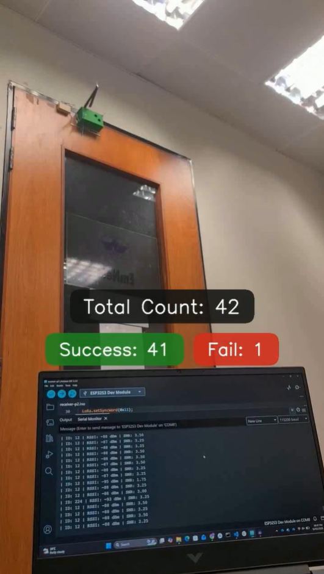
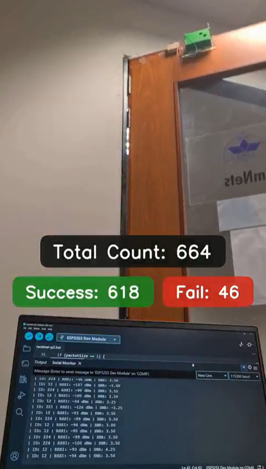
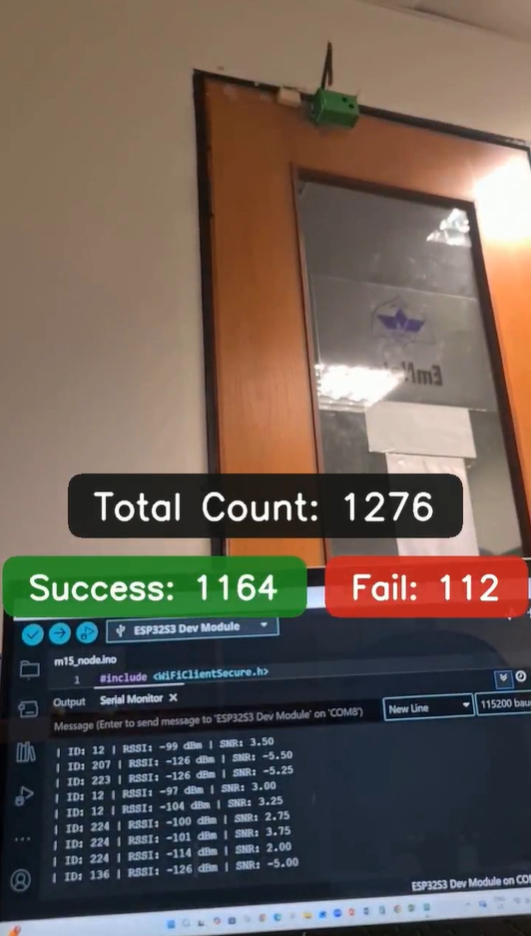
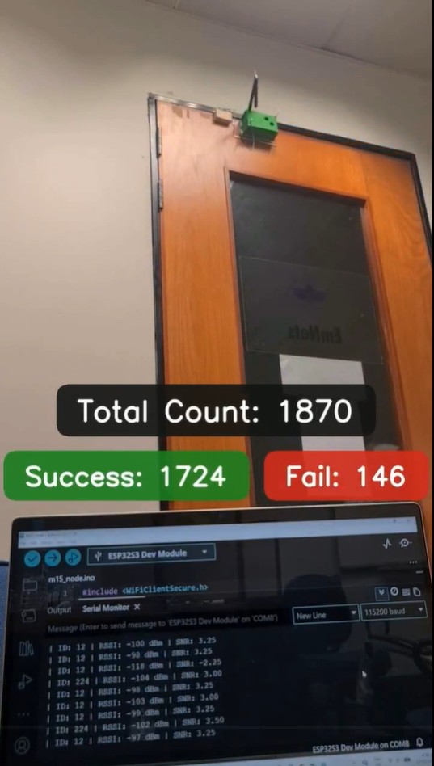

# Media Gallery

Experiment trials and build documentation for the motion-coupled sensing platform.

---

## Bin Field Deployment

Five units deployed sequentially across campus:

| Location | Traffic Profile |
|:---|:---|
| L1 — Library | High traffic during academic hours |
| L2 — Business School | Moderate–high traffic, peaks at class transitions |
| L3 — Cafe Entrance | High traffic concentrated around meal times |
| L4 — Cafeteria | High traffic, rapid successive actuations |
| L5 — Dormitories | Variable traffic, peaks morning and evening |

---

## Door Unit 

|  |  |  |  |
|---|---|---|---|

[Watch full trial on Drive](https://shorturl.at/BA1z8)

---

## Cabinet Unit 

|  |  |  |  |
|---|---|---|---|

[Watch full trial on Drive]( https://shorturl.at/NqOQz)

---

## Standalone Module Test — 10,000 Iterations

|  |  |  |  |
|---|---|---|---|

[Watch full test on Drive](https://tinyurl.com/yn5ekxc2)
